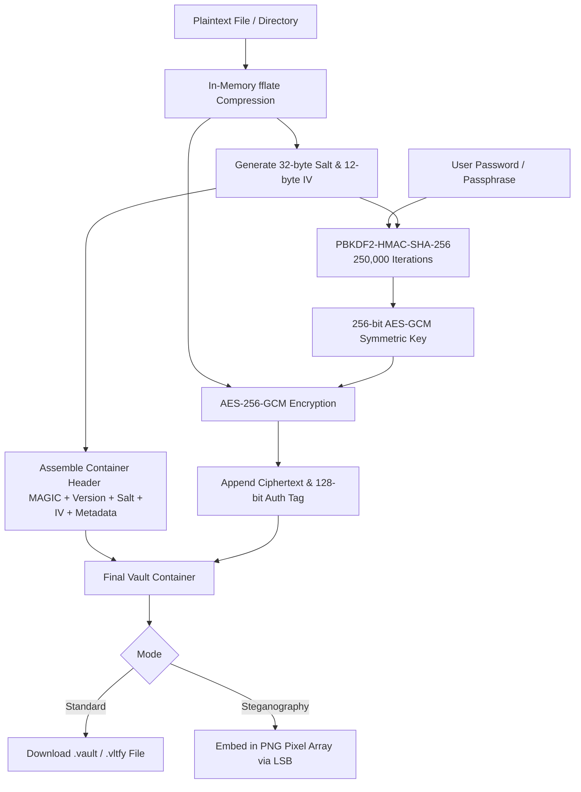

# Vaultify — Zero-Knowledge Offline File Encryption & Steganography

[](LICENSE)
[](https://developer.mozilla.org/en-US/docs/Web/Progressive_web_apps)
[-orange.svg)](https://developer.mozilla.org/en-US/docs/Web/API/Web_Crypto_API)
[]()

> **Vaultify** is a military-grade, 100% client-side offline file encryption and image steganography suite. It transforms sensitive files into tamper-proof encrypted containers or conceals them inside ordinary PNG images — with zero server interaction, zero telemetry, and instant in-memory self-destruction.

---

## Key Features

- **100% Offline & Client-Side Execution**: All cryptographic operations occur exclusively in browser memory via the native [Web Crypto API](https://developer.mozilla.org/en-US/docs/Web/API/Web_Crypto_API). Your files and keys never traverse a network.
- **Authenticated Encryption (AES-256-GCM)**: Employs 256-bit Galois/Counter Mode (GCM), providing end-to-end confidentiality alongside tamper detection and integrity verification (AEAD).
- **Hardened Key Derivation (PBKDF2)**: Derives keys using PBKDF2-HMAC-SHA-256 with 250,000 iterations (configurable) and 32-byte cryptographically secure random salts.
- **Image Steganography**: Embeds encrypted payloads inside PNG images. Output images look completely ordinary while housing encrypted files.
- **Multi-File & Folder Bundles**: Drag and drop batches of files or entire folders. Vaultify compresses them in-memory via `fflate` before encryption.
- **Custom Format & Extension Masking**: Save encrypted vaults as `.vault`, `.vltfy`, or disguise them under arbitrary extensions (`.dat`, `.png`, `.bin`).
- **In-Memory Preview & Self-Destruct**: View decrypted images, audio, video, PDF, and text directly in memory. Triggering "Self-Destruct" immediately wipes memory buffers, revokes all Blob URLs, and cleanses the DOM.
- **Cryptographic Password Generator**: Generates high-entropy 4-word Diceware passphrases or 20-character complex cryptographic strings using `crypto.getRandomValues()`.
- **Installable PWA**: Includes a lightweight Service Worker cache and Web App Manifest for complete offline availability as a standalone desktop/mobile app.

---

## Architecture & Container Specification

### Binary Container Structure (`.vltfy` / `.vault`)

Vaultify packages encrypted data into a structured binary container:

```
+-----------------------------------------------------------------------+
|  MAGIC SIGNATURE (5 bytes): 0x56 0x4C 0x54 0x46 0x59 ("VLTFY")       |
+-----------------------------------------------------------------------+
|  VERSION (1 byte): 0x01                                               |
+-----------------------------------------------------------------------+
|  SALT (32 bytes): Cryptographically random PBKDF2 salt                |
+-----------------------------------------------------------------------+
|  IV / NONCE (12 bytes): Unique AES-GCM Initialization Vector          |
+-----------------------------------------------------------------------+
|  METADATA LENGTH (4 bytes): Uint32 Big-Endian                         |
+-----------------------------------------------------------------------+
|  METADATA (JSON string): Encrypted filename, MIME type, size, flags   |
+-----------------------------------------------------------------------+
|  CIPHERTEXT + AUTH TAG (Remaining bytes): AES-256-GCM payload         |
+-----------------------------------------------------------------------+
```

### Cryptographic Workflow



---

## File Structure

```
├── index.html       # Single-page UI with encryption, decryption, password generator & guides
├── style.css        # Clean cyber-minimalist dark mode theme with responsive layout
├── app.js           # Core state management, Web Crypto routines, steganography & memory hygiene
├── fflate.min.js    # High-performance in-memory compression for folder & multi-file bundling
├── manifest.json    # Progressive Web App manifest
├── sw.js            # Service worker enabling zero-connectivity offline usage
└── .gitignore       # Git ignore rules for OS and editor artifacts
```

---

## Security Model & Threat Assessment

| Security Property | Implementation Details |
| :--- | :--- |
| **Confidentiality** | AES-256-GCM authenticated cipher preventing unauthorized inspection. |
| **Integrity & Tamper Detection** | 128-bit GCM authentication tag. Any alteration of ciphertext aborts decryption. |
| **Brute-Force Resistance** | High-iteration PBKDF2 (default 250,000 rounds) increases dictionary attack costs. |
| **Zero-Knowledge** | Zero server-side components. No keys, passwords, or files leave the client environment. |
| **Memory Sanitization** | `URL.revokeObjectURL()` and buffer clearance on self-destruct minimize RAM persistence. |

---

## Getting Started

### Local Execution (Static Server)

Because Vaultify uses standard Web APIs and ES modules, you can serve it with any local static HTTP server:

```bash
# Using Python
python -m http.server 8080

# Or using Node http-server / npx serve
npx serve .
```

Open `http://localhost:8080` in your web browser.

### PWA Installation
1. Visit the app in any modern browser (Chrome, Firefox, Brave, Safari, Edge).
2. Click the **Install** button in your browser's address bar to install Vaultify locally.
3. Access Vaultify offline anytime without an active internet connection.

---

## License

This project is licensed under the [MIT License](LICENSE).
