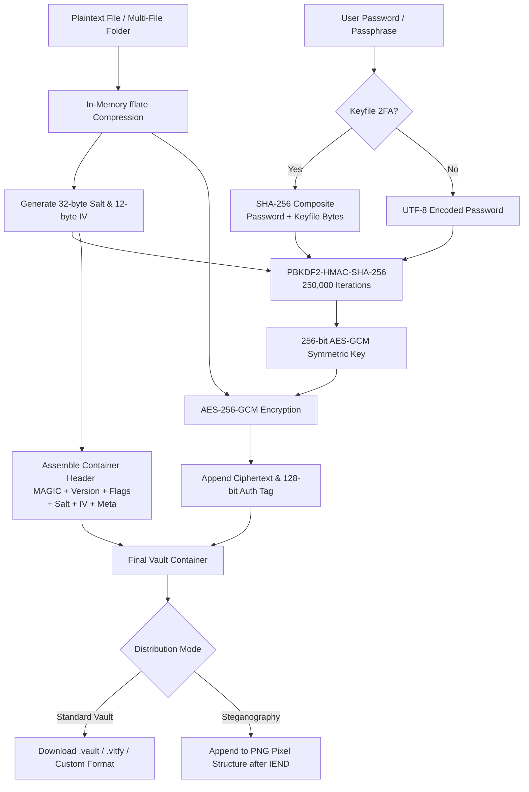

# Vaultify — Zero-Knowledge Offline File Encryption & Steganography Suite

[](LICENSE)
[](https://developer.mozilla.org/en-US/docs/Web/Progressive_web_apps)
[-orange.svg)](https://developer.mozilla.org/en-US/docs/Web/API/Web_Crypto_API)
[]()
[](https://www.linkedin.com/in/srinivasajan/)

> **Vaultify** is a military-grade, 100% client-side zero-knowledge file encryption, image steganography, integrity verification, and digital shredding suite. It transforms sensitive files into tamper-proof encrypted containers or conceals them inside ordinary PNG carrier photos — with zero server interaction, zero telemetry, dual-factor keyfile defense, and instant in-memory self-destruction.

---

## 👨‍💻 Created by Srinivas Jangiti

| Platform | Handle / Link |
| :--- | :--- |
| **LinkedIn** | [linkedin.com/in/srinivasajan](https://www.linkedin.com/in/srinivasajan/) |
| **X (Twitter)** | [x.com/sriwanders](https://x.com/sriwanders) |
| **Substack** | [substack.com/@sriwanders](https://substack.com/@sriwanders) |
| **Medium** | [medium.com/@sriwanders](https://medium.com/@sriwanders) |
| **YouTube** | [youtube.com/@srinivasjan](https://www.youtube.com/@srinivasjan) |
| **Email** | [srinivasajan.work@gmail.com](mailto:srinivasajan.work@gmail.com) |
| **Mobile** | `+91 8767505121` |

---

## ⚡ Key Features

- **100% Offline & Client-Side Execution**: All cryptographic routines run strictly inside browser memory via the native [Web Crypto API](https://developer.mozilla.org/en-US/docs/Web/API/Web_Crypto_API). Your files, keys, and passphrases never touch a server or network.
- **Authenticated Encryption (AES-256-GCM)**: Uses 256-bit Galois/Counter Mode (GCM) with a 128-bit authentication tag, guaranteeing confidentiality, integrity, and tamper detection (AEAD).
- **Dual-Factor Security (Password + Keyfile 2FA)**: Strengthen vaults with an optional physical `.key` cryptographic keyfile. The key derivation fuses `SHA-256(Passphrase || KeyfileBytes)` through PBKDF2, rendering brute-force attacks impossible without physical possession of the file.
- **Custom Carrier Image Steganography**: Conceal encrypted vaults inside innocent-looking PNG carrier images. Choose the built-in **Cyber Shield Carrier** or upload **any custom photo** (PNG, JPG, WebP). Decrypt simply by dropping the PNG photo back into Vaultify.
- **Interactive In-Browser ZIP Archive Explorer**: Decrypt multi-file or folder vaults directly in browser memory without extracting to your drive. Search files, preview images, PDFs, code, text, or audio inline, and download individual files or the complete archive.
- **Cryptographic Hash & Integrity Inspector**: Real-time client-side calculation of **SHA-256**, **SHA-512**, and **SHA-1** fingerprints. Includes an instant **Checksum Match Verifier** to audit file integrity against tampering.
- **Digital File Shredder & Data Sanitizer**: Client-side data destruction simulator supporting **DoD 5220.22-M** (3-pass 0x00, 0xFF, CSPRNG noise), **NIST SP 800-88 Rev 1**, and Zero-fill overwrites. Generates verifiable, timestamped **Certificates of Digital Destruction**.
- **Cryptographic Password Generator**: Select from **4-Word Diceware**, **6-Word Diceware**, **24-Character Complex**, or **256-Bit Raw Hex** cryptographic keys powered by `crypto.getRandomValues()`.
- **In-Memory Preview & Self-Destruct**: View decrypted images, audio, video, PDFs, and text directly in memory. Triggering "Self-Destruct" immediately wipes memory buffers, revokes all Blob URLs, and cleanses the DOM.
- **Installable PWA (v2)**: Optimized Service Worker cache and Web App Manifest enable standalone offline operation on desktop and mobile.

---

## 📐 Architecture & Container Specification

### Binary Container Structure (`.vltfy` / `.vault` v2.0)

Vaultify packages encrypted data into an authenticated binary structure:

```
+-------------------------------------------------------------------------------+
|  MAGIC SIGNATURE (5 bytes): 0x56 0x4C 0x54 0x46 0x59 ("VLTFY")               |
+-------------------------------------------------------------------------------+
|  VERSION (1 byte): 0x02 (v2 with flags) or 0x01 (legacy backward-compatible)  |
+-------------------------------------------------------------------------------+
|  FLAGS (1 byte): Bit 0 = hasKeyfile (0x01 = 2FA Keyfile Required, 0x00 = PW)  |
+-------------------------------------------------------------------------------+
|  SALT (32 bytes): Cryptographically secure PBKDF2 random salt                 |
+-------------------------------------------------------------------------------+
|  IV / NONCE (12 bytes): Unique AES-256-GCM Initialization Vector              |
+-------------------------------------------------------------------------------+
|  METADATA IV (12 bytes): Unique IV for encrypted metadata block               |
+-------------------------------------------------------------------------------+
|  METADATA LENGTH (4 bytes): Uint32 Little-Endian length indicator             |
+-------------------------------------------------------------------------------+
|  METADATA (Ciphertext): Encrypted JSON string (Filename, MIME, Size, Flags)   |
+-------------------------------------------------------------------------------+
|  CIPHERTEXT + 128-bit AUTH TAG: AES-256-GCM authenticated payload             |
+-------------------------------------------------------------------------------+
```

### Cryptographic Workflow



---

## 🛡️ Security Model & Threat Assessment

| Security Property | Implementation Details |
| :--- | :--- |
| **Confidentiality** | AES-256-GCM authenticated cipher preventing unauthorized plaintext access. |
| **Integrity & Tamper Proofing** | 128-bit GCM authentication tag. Any alteration of ciphertext aborts decryption. |
| **Dual-Factor Protection (2FA)** | Key derivation incorporates physical `.key` entropy, neutralizing dictionary and credential-stuffing attacks. |
| **Brute-Force Cost** | High-iteration PBKDF2 (default 250,000 rounds) makes offline GPU dictionary attacks prohibitively expensive. |
| **Zero-Knowledge** | Zero server-side components. No keys, passwords, hashes, or files leave the client browser RAM. |
| **Memory Sanitization** | `URL.revokeObjectURL()`, typed array `.fill(0)` zeroing, and self-destruct triggers purge in-memory buffers. |

---

## 📁 Repository Structure

```
├── index.html       # Single-page UI with encryption, decryption, hash tool, shredder & creator profile
├── style.css        # Neo-brutalist cyber-minimalist dark/light mode theme with responsive layout
├── app.js           # Main application state, Web Crypto routines, ZIP explorer & memory hygiene
├── fflate.min.js    # High-performance in-memory compression for folder & archive bundling
├── manifest.json    # Progressive Web App manifest
├── sw.js            # Service Worker enabling zero-connectivity offline usage
├── LICENSE          # MIT License (Copyright 2026 Srinivas Jangiti)
└── README.md        # Comprehensive documentation & architecture specification
```

---

## 🚀 Getting Started

### Local Execution (Static HTTP Server)

Because Vaultify uses standard modern Web APIs, you can run it locally with any static HTTP server:

```bash
# Using Python 3
python -m http.server 8080

# Or using Node.js
npx serve .
```

Navigate to `http://localhost:8080` in your web browser.

### Progressive Web App (PWA) Offline Installation

1. Open Vaultify in any modern browser (Chrome, Brave, Edge, Firefox, Safari).
2. Click the **Install** button in your browser's address bar.
3. Launch Vaultify offline anytime without an active internet connection.

---

## 📜 License

This project is licensed under the [MIT License](LICENSE) — Copyright (c) 2026 **Srinivas Jangiti**.
